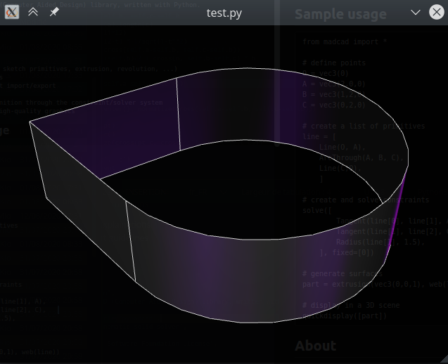

# Py-MADCAD

*>>> it's time to throw parametric softwares out !*

Simple yet powerful CAD (Computer Aided Design) library, written with Python.

- [Installation]()
- [Documentation]()

## Features

- surface generation (3D sketch primitives, extrusion, revolution, ...)
- fast boolean operations
- common mesh file format import/export
- kinematic manipulation
- implicit geometry definition through the constraint/solver system
- objects display with high-quality graphics

## Sample usage

```python
from madcad import *

# define points
O = vec3(0)
A = vec3(2,0,0)
B = vec3(1,2,0)
C = vec3(0,2,0)

# create a list of primitives
line = [
	Line(O, A),          
	ArcThrough(A, B, C),
	Line(C,O),           
	]

# create and solve constraints
solve([
		Tangent(line[0], line[1], A),   
		Tangent(line[1], line[2], C),   
		Radius(line[1], 1.5),           
	], fixed=[0])

# generate surfaces
part = extrusion(vec3(0,0,1), web(line))

# display in a 3D scene
quickdisplay([part])
```

The result will be this window


## About

MADCAD is born from the idea that the current approach of parametric CADs for mechanical engineering is not the best possible. This library is part of a project targeting the best possible mechanical design tool for both engineers and handymen. See the documentation for more details.

## License   

Copyright 2019-2020 Yves Dejonghe <yves.dejonghe.y@gmail.com>

This library is distributed under the LGPL-v3 license. A copy of that license is provided with this software.


